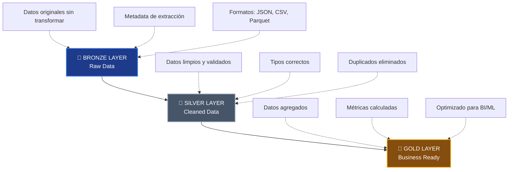

# � Data Engineering Portfolio - Python ETL Projects

[](https://www.python.org/)
[](https://pandas.pydata.org/)
[](https://jupyter.org/)
[](https://www.sqlite.org/)

## �📋 Descripción del Proyecto

Portfolio completo de **Ingeniería de Datos** que demuestra dominio en procesos **ETL (Extract, Transform, Load)** utilizando diferentes tecnologías y metodologías. Este repositorio implementa la **Arquitectura Medallion** (Bronze → Silver → Gold) y múltiples patrones de diseño para pipelines de datos escalables y mantenibles.

## 🎯 Objetivos del Proyecto

- ✅ Implementar pipelines ETL end-to-end con múltiples fuentes de datos
- ✅ Aplicar arquitectura Medallion para organización de datos
- ✅ Demostrar expertise en herramientas modernas de procesamiento de datos
- ✅ Implementar buenas prácticas de ingeniería de datos (logging, validación, manejo de errores)
- ✅ Trabajar con diferentes formatos y fuentes: APIs, CSV, bases de datos, web scraping

## 🏗️ Arquitectura Medallion Implementada



## 🛠️ Tecnologías y Herramientas

### Core Technologies

| Tecnología | Descripción |
|------------|-------------|
|  | Lenguaje principal |
|  | Procesamiento y análisis de datos |
|  | Procesamiento de alto rendimiento |
|  | Formato columnar eficiente (Parquet) |
|  | Base de datos relacional |

### Data Extraction

- **Requests** - Consumo de APIs REST
- **Selenium + WebDriver** - Web scraping dinámico
- **BeautifulSoup** - Parsing HTML

### Data Quality

- **Logging** - Trazabilidad y debugging
- **Type Hints** - Código más robusto y mantenible
- **Error Handling** - Manejo comprehensivo de excepciones

### Visualization

- **Matplotlib** - Gráficos estáticos
- **Seaborn** - Visualizaciones estadísticas
- **Plotly** - Dashboards interactivos (opcional)

## 📁 Estructura del Proyecto

```
data-engineering-portfolio/
│
├── 📊 Pandas_ETL.ipynb                      # ETL complejo con e-commerce data
├── ⚡ ETL_Polars.ipynb                      # ETL de alto rendimiento
├── 🏗️ Pyarrow_Ejercicios.ipynb             # Procesamiento columnar
├── 📝 pyarrow_colab.py                      # Script PyArrow standalone
├── 🗄️ Conexion_DB_SQLite_ETL.ipynb         # Pipeline con base de datos
├── 🌐 Request_API_ETL_con_API_Pokemon.ipynb # Consumo de APIs REST
├── 🕷️ Webscrapping_Selenium.ipynb          # Extracción desde Wikipedia
│
├── .gitignore
├── requirements.txt
├── LICENSE
└── README.md
```

## 🚀 Proyectos Implementados

### 📊 1. ETL E-Commerce con Pandas

**Archivo:** `Pandas_ETL.ipynb`

**Descripción:** Pipeline ETL complejo para análisis de datos de e-commerce con múltiples dimensiones.

**Características:**
- Generación de datos sintéticos (Clientes, Productos, Ventas, Inventario)
- Limpieza y normalización de 5000+ registros
- 12+ visualizaciones avanzadas (heatmaps, box plots, scatter plots)
- Análisis RFM (Recency, Frequency, Monetary)
- Detección de patrones de compra por hora/día
- Cálculo de métricas de negocio (ticket promedio, margen de ganancia)

**Métricas Procesadas:**
- 🧑‍🤝‍🧑 1000 clientes
- 📦 200 productos
- 💰 5000 transacciones
- 🏷️ 6 categorías de productos

---

### ⚡ 2. ETL de Alto Rendimiento con Polars

**Archivo:** `ETL_Polars.ipynb`

**Descripción:** Implementación de ETL utilizando Polars para procesamiento ultrarrápido.

**Ventajas de Polars:**
- ⚡ 5-10x más rápido que Pandas
- 💾 Menor consumo de memoria
- 🔄 Lazy evaluation para optimización automática
- 🎯 API moderna y expresiva

**Pipeline:**
1. Extracción de 1000 registros de ventas
2. Transformaciones con sintaxis lazy
3. Agregaciones por múltiples dimensiones
4. Exportación a Parquet comprimido

---

### 🏗️ 3. Procesamiento Columnar con PyArrow

**Archivos:** `Pyarrow_Ejercicios.ipynb`, `pyarrow_colab.py`

**Descripción:** Implementación de pipeline ETL usando formato Parquet y PyArrow.

**Características Destacadas:**
- Conversión entre Pandas y PyArrow
- Compresión eficiente (Snappy, GZIP)
- Lectura selectiva de columnas (predicate pushdown)
- Particionamiento de datos
- Comparativa de rendimiento vs CSV

**Benchmark Results:**
- 📈 Parquet 3-5x más rápido que CSV
- 💾 Tamaño de archivo 60-70% menor
- ⚡ Lectura columnar optimizada

---

### 🗄️ 4. ETL con Base de Datos SQLite

**Archivo:** `Conexion_DB_SQLite_ETL.ipynb`

**Descripción:** Pipeline ETL completo integrando base de datos relacional.

**Funcionalidades:**
- Creación y gestión de base de datos SQLite
- Índices para optimización de consultas
- Transacciones ACID
- Validación de calidad de datos
- Consultas SQL complejas (GROUP BY, JOIN, agregaciones)
- Tablas dimensionales agregadas

**Tablas Generadas:**
- `ventas` - Tabla de hechos principal
- `ventas_por_producto` - Agregaciones por producto
- `ventas_por_region` - Agregaciones geográficas
- `ventas_mensuales` - Series temporales

---

### 🌐 5. Consumo de APIs REST - PokéAPI

**Archivo:** `Request_API_ETL_con_API_Pokemon.ipynb`

**Descripción:** ETL completo consumiendo API pública con arquitectura Medallion.

**API:** [PokéAPI](https://pokeapi.co/)

**Pipeline Implementado:**

#### 🔵 Bronze Layer:
- Extracción de 50 Pokémon con rate limiting
- Almacenamiento de JSON raw
- Metadata de extracción

#### 🥈 Silver Layer:
4 tablas normalizadas:
- `pokemon_base` - Información básica
- `pokemon_types` - Tipos de Pokémon
- `pokemon_stats` - Estadísticas de combate
- `pokemon_abilities` - Habilidades

#### 🥇 Gold Layer:
- `pokemon_summary` - Vista consolidada con métricas
- `type_analysis` - Análisis estadístico por tipo
- `stats_pivot` - Tabla pivote de estadísticas

**Características:**
- ⏱️ Rate limiting respetuoso con la API
- 🛡️ Manejo robusto de errores HTTP
- 🔄 Reintentos automáticos
- 📝 Logging comprehensivo

---

### 🕷️ 6. Web Scraping con Selenium - Wikipedia

**Archivo:** `Webscrapping_Selenium.ipynb`

**Descripción:** ETL de web scraping ético extrayendo datos de países desde Wikipedia.

**Fuente:** [List of countries by population](https://en.wikipedia.org/wiki/List_of_countries_and_dependencies_by_population)

**Implementación:**
- Web scraping con Selenium en modo headless
- Validación de URLs por seguridad
- Extracción de tablas HTML complejas
- Limpieza de datos con expresiones regulares

**Características de Seguridad:**
- 🔒 Solo permite URLs HTTPS
- ✅ Whitelist de dominios (wikipedia.org)
- ⏱️ Rate limiting respetuoso
- 🤖 User-agent legítimo
- ⏰ Timeout de seguridad

**Transformaciones:**
- Limpieza de números con formato internacional
- Conversión de tipos de datos
- Categorización por población
- Cálculo de métricas derivadas
- Validación de rangos

**Output:**
- CSV y Excel con 50 países
- Estadísticas descriptivas
- Top 10 países más poblados
- Análisis de porcentaje mundial

## 💡 Habilidades Técnicas Demostradas

<table>
<tr>
<td width="50%">

### Data Engineering
- ✅ Diseño e implementación de pipelines ETL
- ✅ Arquitectura Medallion (Bronze-Silver-Gold)
- ✅ Data quality y validación
- ✅ Manejo de múltiples fuentes de datos
- ✅ Optimización de rendimiento

### Python Development
- ✅ POO (Programación Orientada a Objetos)
- ✅ Type hints y documentación
- ✅ Manejo de excepciones robusto
- ✅ Logging y debugging
- ✅ Code organization y modularización

### Data Processing
- ✅ Pandas (manipulación de datos)
- ✅ Polars (alto rendimiento)
- ✅ PyArrow (formato columnar)
- ✅ NumPy (operaciones vectorizadas)

</td>
<td width="50%">

### Databases
- ✅ SQL (queries, joins, agregaciones)
- ✅ SQLite (base de datos embebida)
- ✅ Diseño de esquemas
- ✅ Índices y optimización

### APIs & Web
- ✅ Consumo de APIs REST
- ✅ Web scraping ético
- ✅ Selenium automation
- ✅ Rate limiting y retries

### Data Visualization
- ✅ Matplotlib y Seaborn
- ✅ 12+ tipos de gráficos
- ✅ Heatmaps y análisis temporal
- ✅ Dashboards analíticos

</td>
</tr>
</table>

## 📊 Métricas del Proyecto

| Métrica | Valor |
|---------|-------|
| 📁 Proyectos Completados | 6 |
| 💻 Líneas de Código | 3000+ |
| 📓 Notebooks Jupyter | 6 |
| 📊 Registros Procesados | 10,000+ |
| 📈 Visualizaciones Creadas | 15+ |
| 🔌 Fuentes de Datos | 5 (API, CSV, DB, Web, Sintético) |
| 📄 Formatos Soportados | JSON, CSV, Parquet, Excel, SQLite |

## 🚀 Instalación y Uso

### Requisitos Previos

- Python 3.8 o superior
- pip (gestor de paquetes)
- Google Colab (opcional, para notebooks)

### Instalación

```bash
# Clonar el repositorio
git clone https://github.com/tu-usuario/data-engineering-portfolio.git
cd data-engineering-portfolio

# Crear entorno virtual (recomendado)
python -m venv venv
source venv/bin/activate  # En Windows: venv\Scripts\activate

# Instalar dependencias
pip install -r requirements.txt
```

### Dependencias Principales

```txt
pandas>=2.0.0
polars>=0.19.0
pyarrow>=13.0.0
numpy>=1.24.0
matplotlib>=3.7.0
seaborn>=0.12.0
requests>=2.31.0
selenium>=4.15.0
webdriver-manager>=4.0.0
openpyxl>=3.1.0
```

### Ejecución

#### Opción 1: Jupyter Notebooks Localmente

```bash
jupyter notebook
# Navegar a cualquier archivo .ipynb y ejecutar
```

#### Opción 2: Google Colab

1. Subir notebooks a Google Drive
2. Abrir con Google Colab
3. Ejecutar celdas secuencialmente

#### Opción 3: Scripts Python

```bash
python pyarrow_colab.py
```

## 📈 Ejemplos de Uso

### ETL Básico con Pandas

```python
import pandas as pd

# Extract
df = pd.read_csv('datos_raw.csv')

# Transform
df_clean = df.dropna()
df_clean['total'] = df_clean['cantidad'] * df_clean['precio']

# Load
df_clean.to_csv('datos_procesados.csv', index=False)
```

### ETL con Polars (Alto Rendimiento)

```python
import polars as pl

# Extract y Transform (Lazy)
df = (
    pl.scan_csv('ventas.csv')
    .filter(pl.col('estado') == 'Completado')
    .with_columns([
        (pl.col('cantidad') * pl.col('precio')).alias('total')
    ])
    .collect()
)

# Load
df.write_parquet('ventas_procesadas.parquet')
```

### Consumo de API con Rate Limiting

```python
import requests
import time

def extract_with_rate_limit(api_url, limit=100):
    data = []
    for i in range(limit):
        response = requests.get(f"{api_url}/{i}")
        if response.status_code == 200:
            data.append(response.json())
        time.sleep(0.1)  # Rate limiting
    return data
```

## 🎓 Patrones y Mejores Prácticas Implementadas

### 1. Separation of Concerns
Cada capa (Bronze, Silver, Gold) tiene responsabilidades claramente definidas.

### 2. DRY (Don't Repeat Yourself)
Funciones reutilizables para operaciones comunes.

### 3. Error Handling

```python
try:
    df = pd.read_csv('file.csv')
except FileNotFoundError:
    logger.error("Archivo no encontrado")
    df = create_sample_data()
except Exception as e:
    logger.error(f"Error inesperado: {e}")
    raise
```

### 4. Logging

```python
import logging

logging.basicConfig(level=logging.INFO)
logger = logging.getLogger(__name__)

logger.info("Iniciando ETL...")
logger.warning("Datos faltantes detectados")
logger.error("Error crítico en transformación")
```

### 5. Type Hints

```python
from typing import List, Dict

def transform_data(df: pd.DataFrame) -> pd.DataFrame:
    """Transforma los datos aplicando reglas de negocio."""
    return df.dropna()
```

### 6. Documentation
Docstrings en formato Google/NumPy para todas las funciones.

## 🔄 Roadmap Futuro

- [ ] Implementar Apache Airflow para orquestación
- [ ] Agregar tests unitarios con pytest
- [ ] Integrar con AWS S3 para almacenamiento cloud
- [ ] Implementar CI/CD con GitHub Actions
- [ ] Crear dashboard interactivo con Streamlit
- [ ] Agregar soporte para Apache Spark
- [ ] Implementar data versioning con DVC
- [ ] Agregar monitoreo con Great Expectations

## 👨‍💻 Sobre mí

Soy Evaristo Sandoval Gil, desarrollador con formación en desarrollo web y especialización en 
Big Data, IA y Cloud, actualmente enfocado en iniciar mi carrera profesional en el mundo de los datos.

## 📧 Contacto

Si eres reclutador, technical lead o formas parte de un equipo de datos y quieres comentar este proyecto
o mi perfil profesional, puedes contactarme a través de LinkedIn o GitHub.
Si tienes preguntas o sugerencias, no dudes en abrir un issue en este repositorio.

---

<div align="center">

⭐ **Si este repositorio te fue útil, considera darle una estrella!** ⭐

**Hecho con ❤️ y Python**

</div>
